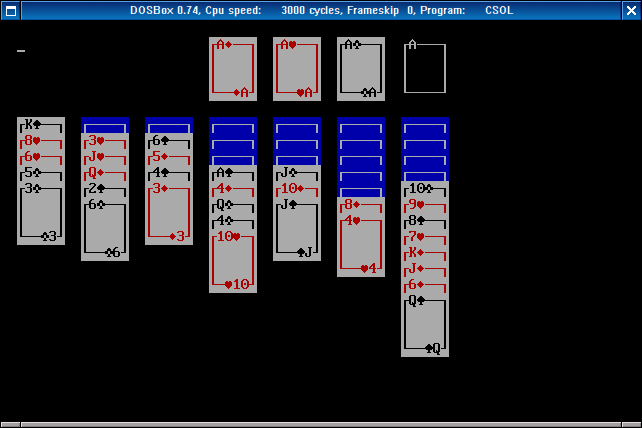

# csol for DOS

Can be compiled using:
- [pdcurses](https://pdcurses.sourceforge.io/)
- [Open Watcom](http://www.openwatcom.org/)

## Compiling using DOSBox

- Download and unpack the csol sources
- Download the PDCurses source from https://github.com/wmcbrine/PDCurses/releases and unpack to `dos/pdcurses`
- Download the installer for Open Watcom C/C++ for DOS from http://www.openwatcom.org/download.php into the `dos` directory
- Start dosbox in the root of the csol source tree (e.g. run `dosbox .`)
- Go to the directory containing the Open Watcom installer: `cd dos`
- Run the installer, e.g. `open-w~1.exe`
- When asked for the install path, type `C:\DOS\WATCOM`
- Finish the installation using the default settings.
- The installer creates an `AUTOEXEC.BAT` file that sets up the correct environment. It should look like this:

        PATH C:\DOS\WATCOM\BINW;%PATH%;
        SET INCLUDE=C:\DOS\WATCOM\H;
        SET WATCOM=C:\DOS\WATCOM
        SET EDPATH=C:\DOS\WATCOM\EDDAT
        SET WIPFC=C:\DOS\WATCOM\WIPFC

- Run it: `..\AUTOEXEC.BAT`
- Then go to the directory containing the DOS makefiles for PDCurses: `CD PDCURSES\DOS`
- Compile PDCurses: `wmake -f Makefile.wcc`
- Return to the dos directory: `cd \dos`
- Compile csol: `wmake`
- You can now run csol from the current directory: `csol`
